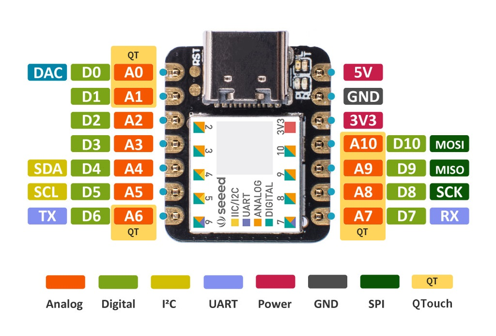
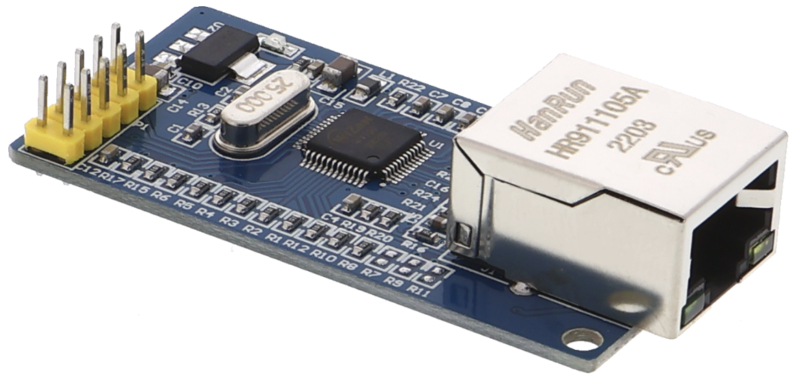

# PlatformIO W5500 Ethernet Driver (lwIP)
This project provides a modular, SPI-based Ethernet interface for the W5500 Ethernet controller, integrated with the **lwIP** TCP/IP stack and tailored for **Arduino** platforms using **PlatformIO**. It includes a minimal, fully C++-based HTTP server example leveraging raw lwIP functionality.

## 🌟 Features

- **Ethernet abstraction layer & W5500 Driver**
  
  Implements a low-level RAW MAC driver for the W5500 Ethernet chip, enabling direct lwIP communication without relying on external libraries.

- **DHCP and Static IP Support**
  
  Supports both DHCP and static IP address configuration via a single compile-time flag (`USE_STATIC_IP`).

- **Minimal HTTP Server**
  
  Runs a lightweight embedded HTTP server on port 80 using lwIP’s raw TCP API, which counts and displays the number of visits to the root endpoint (`GET /`).

- **Mixed Arduino and Non-Arduino library support**
  
  Cleanly integrates the upstream lwIP TCP/IP stack into an Arduino PlatformIO project using a self-contained wrapper library, avoiding direct modification of third-party sources. Third-party lwIP source code is included as a Git submodule under `thirdparty/lwip/`, kept read-only to simplify updates and prevent accidental changes.


## 🛠 What You Need

- Arduino board (this project uses Seeeduino XIAO SAMD21)
- USB cable
- The W5500 Ethernet module
- Router or switch with an Ethernet cable (RJ45)
- Breadboard and jumper wires
- (Optional) External LED + 220Ω or 330Ω resistor (if not using the built-in LED)

## ⚙️ Circuit Diagram

- **Pin 13**: Built-in LED (no wiring needed)
- **Pin 11**: Built-in LED (no wiring needed)
- **Pin 12**: Built-in LED (no wiring needed)
- **Pin 7**: W5500 module SCS
- **Pin 8**: W5500 module CLK
- **Pin 9**: W5500 module MISO
- **Pin 10**: W5500 module MOSI 
- **Pin GND**: W5500 module GND
- **Pin 5V**: W5500 module 5V 

> Note: W5500 RST, INT and 3.3V pins are not connected (open).






## 📁 Project Structure

```
project-root/
├── lib/
│   └── lwip_wrapper/                <-- PlatformIO wrapper library
│       ├── port/
│       │   ├── src/                 <-- lwIP port sources
│       │   │   ├── ethif.c
│       │   │   ├── w5500.c
│       │   │   └── sys_arch.cpp
│       │   └── include/             <-- lwIP headers and config
│       │       ├── arch/            <-- Architecture-specific headers
│       │       │   ├── cc.h
│       │       │   └── sys_arch.h
│       │       ├── ethif.h
│       │       └── lwipopts.h       <-- lwIP configuration header
│       ├── README.md                <-- Starting from Scratch: lwIP Wrapper Library 
│       └── library.json             <-- PlatformIO build instructions
├── thirdparty/
│   └── lwip/                        <-- lwIP source (Git submodule, read-only)
│       └── src/
├── src/
│   └── main.cpp                     <-- Application code
├── platformio.ini                   <-- PlatformIO project configuration
└── README.md                        <-- PlatformIO W5500 Ethernet Driver (lwIP) <<< YOU ARE HERE
```

## 💡 Concepts

### Wrapper Library Architecture
This project showcases a **wrapper library approach** for integrating [lwIP (Lightweight IP)](https://savannah.nongnu.org/projects/lwip/) into PlatformIO-based Arduino projects. This methodology ensures:

- No modifications to upstream lwIP sources.
- Encapsulation of PlatformIO-specific logic and configurations.
- Clean and maintainable separation between third-party libraries and user code.

### Bare Metal Porting Overview

Porting lwIP to a bare-metal environment (i.e., no OS) requires implementation of system abstraction layers to fulfill lwIP's basic expectations:

- Critical section protection (for concurrency safety)
- Timing utilities (for timeouts and delays)
- Debugging/logging hooks
- Type definitions and structure packing
- Optional: assertion support and debug utilities

This project uses NO_SYS=1 (no OS primitives) and targets AVR and ARM Cortex-M platforms.

Provided port files:

- `ethif.c` / `ethif.h`: define a hardware-agnostic generic Ethernet interface with SPI callbacks
- `w5500.c`: W5500 SPI-based driver (MACRAW mode)
- `sys_arch.cpp`: minimal system abstraction layer for critical sections, delays (AVR and ARM Cortex-M platforms)
- `sys_arch.h`: architecture-specific system abstraction types for lwIP
- `cc.h`: Compiler and platform-specific defines (Cortex-M platform)
- `lwipopts.h`: lwIP stack configuration options for no-OS embedded system

For more details, see the [lwIP Bare Metal Porting Guide](https://lwip.fandom.com/wiki/Porting_For_Bare_Metal).


### Ethernet abstraction layer (`ethif.c`, `ethif.h`)
Defines a hardware-agnostic Ethernet abstraction layer (`ethif`) using SPI callbacks and function pointers. This allows clean separation between the lwIP stack and the W5500 driver.

#### Key components

- `struct ethif`: holds SPI callbacks, MAC address, and driver reference
- `struct ethif_driver`: defines driver interface functions (`init`, `tx`, `rx`, and `poll`)
- `ethif_init(struct netif *)`: initializes the lwIP network interface
- `ethif_poll(struct netif *)`: should be called regularly to handle incoming packets and link state changes.
- `ethif_driver_w5500`: is the concrete implementation for W5500 (`w5500.c` ).

#### Integration Example (Arduino Sketch)

1. Configure SPI and Ethernet interface
   ```c++
   static struct ethif ethif_w5500 = {
       NULL,
       [](void *) { digitalWrite(W5500_CS_PIN, LOW); SPI.beginTransaction(...); },
       [](void *) { digitalWrite(W5500_CS_PIN, HIGH); SPI.endTransaction(); },
       [](void *, uint8_t c) { return SPI.transfer(c); },
       (struct eth_addr *)&netif.hwaddr,
       &ethif_driver_w5500
   };
   ```
2. Set up lwIP and interface
   ```c++
   lwip_init();
   memcpy(netif.hwaddr, mac, 6);
   netif_add(&netif, ..., &ethif_w5500, ethif_init, ethernet_input);
   netif_set_default(&netif);
   netif_set_up(&netif);
   netif_set_link_callback(&netif, netif_link_callback);
   ```
3. Poll interface and run HTTP server
   ```c++
   void loop() {
     ethif_poll(&netif);        // Handle RX, link status
     sys_check_timeouts();      // Process lwIP timers
     if (DHCP complete && HTTP not started) {
       start_http_server();     // Starts responding to HTTP requests
     }
   }
   ```

### W5500 Driver (`w5500.c`)
The W5500 driver handles low-level SPI communication and register access for the W5500 Ethernet chip. It implements essential transmit and receive functions for use with lwIP's raw API (no RTOS required). It is compatible with `netif` and structured for clarity and portability.

#### Key components

- SPI Interface Core: all register access is handled via `w5500_spi_io()`, supporting:

  - Register block selection
  - Addressed I/O with command formatting
  - Full-duplex SPI TX/RX

- RX/TX Buffer Management: frame I/O is handled via:

  - `w5500_rx()`: reads payloads and updates buffer pointers
  - `w5500_tx()`: writes frames and waits for SEND_OK or TIMEOUT

- Initialization: `w5500_init()` resets and configures:

  - Mode register
  - PHY configuration
  - Socket buffer sizes
  - MAC address and mode (`MACRAW`)

- Interrupts and Polling:

  - Link status via `PHYCFGR`
  - `w5500_poll()`: integrates link detection and frame handling into the lwIP event loop

#### Integration Example 

1. The driver is registered via
   ```c++
   struct ethif_driver ethif_driver_w5500 = {
      w5500_init,
      w5500_tx,
      w5500_rx,
      w5500_poll
   };
   ```
2. `ethif_driver_w5500` is used inside 'ethif' to link the W5500 hardware driver to lwIP


## ▶️ Getting Started with PlatformIO

1. Install [Visual Studio Code](https://code.visualstudio.com/)
2. Install the [PlatformIO extension](https://platformio.org/)
3. Clone the whole project with submodules

    - If you're cloning the project for the first time and want to include all submodules (e.g., lwIP):

      ```bash
      git clone --recurse-submodules https://gitlab.com/seeed-studio-xiao-samd21/platformio/ethernet-module-lwip.git
      cd ethernet-lwip-project
      ```

    - If you've already cloned the repository without submodules, run:

      ```bash
      git submodule update --init --recursive
      ```
3. Open this project folder in VS Code
   
   Use the File → Open Folder... menu or drag the folder into VS Code.

4. Build and Upload the Firmware

   - Click the **PlatformIO** icon in the sidebar.
   - Select **Upload and Monitor** to compile and flash the firmware to your board.

## References

1. [lwIP - official project site](https://savannah.nongnu.org/projects/lwip/)
2. [lwIP - 2.1.0 Lightweight IP stack's documentation](https://www.nongnu.org/lwip/2_1_x/index.html)
3. [lwIP - Wiki](https://lwip.fandom.com/wiki/Special:AllPages)
4. [lwIP - Porting For Bare Metal](https://lwip.fandom.com/wiki/Porting_For_Bare_Metal)
5. [W5500MacRaw an Arduino sketch demonstrates reading and writing raw Ethernet frames using the Wiznet W5500](https://github.com/njh/W5500MacRaw/tree/main)
6. [Wiznet-ioLibrary_Driver](https://github.com/Wiznet/ioLibrary_Driver)
7. [w5kiss - a stupid simple WizNet W5500 driver](https://github.com/Xerbo/w5kiss/tree/master)
8. [WIZnet-PICO-LWIP-C - lwIP Example for RP2040, RP2350](https://github.com/WIZnet-ioNIC/WIZnet-PICO-LWIP-C/tree/main)
9. [w5500_driver.c - ORYX Embedded W5500 driver source code](https://www.oryx-embedded.com/doc/w5500__driver_8c_source.html)
10. [PlatformIO Documentation](https://docs.platformio.org/)

## License

- This project is licensed under the [MIT License](LICENSE).
- lwIP is used under its original BSD-style license.  

