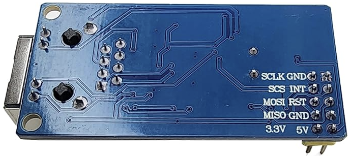

# Ethernet Module lwIP

This project demonstrates a clean and maintainable way to integrate the [lwIP (Lightweight IP)](https://savannah.nongnu.org/projects/lwip/) TCP/IP stack into a PlatformIO Arduino project using a **wrapper library approach**. This approach keeps the upstream lwIP source code untouched and separates PlatformIO-specific build configurations.

## 🌟 Features

- **Modular lwIP Integration**
  
  Cleanly integrates the upstream lwIP TCP/IP stack into an Arduino PlatformIO project using a self-contained wrapper library, avoiding direct modification of third-party sources.

- **Custom W5500 MAC Driver**
  
  Implements a low-level RAW MAC driver for the W5500 Ethernet chip ([lib/lwip_wrapper/port/src/w5500.c](lib/lwip_wrapper/port/src/w5500.c)), enabling direct lwIP communication without relying on external libraries.

- **DHCP and Static IP Support**
  
  Supports both DHCP and static IP address configuration via a single compile-time flag (`USE_STATIC_IP`).

- **Minimal HTTP Server**
  
  Runs a lightweight embedded HTTP server on port 80 using lwIP’s raw TCP API, which counts and displays the number of visits to the root endpoint (`GET /`).

- **Porting Guide Included**
  
  Provides a step-by-step lwIP porting guide and wrapper setup documentation in [lib/lwip_wrapper/README.md](lib/lwip_wrapper/README.md).

- **Non-Invasive Upstream Code Handling**
  
  Third-party lwIP source code is included as a Git submodule under `thirdparty/lwip/`, kept read-only to simplify updates and prevent accidental changes.

- **PlatformIO Build Integration**
  
  Uses `library.json` to manage include paths, source filtering, and compile-time options tailored to PlatformIO’s build system.

## 🛠 What You Need

- Arduino board (this project uses Seeeduino XIAO SAMD21)
- USB cable
- The W5500 Ethernet module
- Router or switch with an Ethernet cable (RJ45)
- Breadboard and jumper wires
- (Optional) External LED + 220Ω or 330Ω resistor (if not using the built-in LED)

## ⚙️ Circuit Diagram

- **Pin 13**: Built-in LED (no wiring needed)
- **Pin 11**: Built-in LED (no wiring needed)
- **Pin 12**: Built-in LED (no wiring needed)
- **Pin 7**: W5500 module SCS
- **Pin 8**: W5500 module CLK
- **Pin 9**: W5500 module MISO
- **Pin 10**: W5500 module MOSI 
- **Pin GND**: W5500 module GND
- **Pin 5V**: W5500 module 5V 

> Note: W5500 module RST, INT and R.3V are not connected (open).




## 📁 Project Structure

```
project-root/
├── lib/
│   └── lwip_wrapper/ ← PlatformIO wrapper library
│       ├── port/
│       │   ├── src/ ← lwIP core source files (e.g., sys_arch.c, ethernetif.c)
│       │   └── include/ ← lwIP headers and config
│       │       ├── arch/ ← port-specific headers (cc.h, sys_arch.h, perf.h)
│       │       └── lwipopts.h ← lwIP configuration header
│       └── library.json ← PlatformIO build instructions and filters
├── thirdparty/
│   └── lwip/ ← lwIP source as Git submodule (read-only)
│       └── src/
├── src/
│   └── main.cpp ← Application code
├── platformio.ini ← PlatformIO project configuration
└── README.md
```

## 💡 Concept: Clean Third-Party Library Integration

We separate raw third-party source code from PlatformIO build logic using this structure:

- `thirdparty/` — Contains raw third-party libraries (e.g., `lwIP`) as Git submodules.  
  ⚠️ **Do not modify** files in this folder; treat as read-only.

- `lib/` — Contains PlatformIO-compatible **wrapper libraries** that:
  - Define build instructions, source filtering, and include paths.
  - Provide configuration headers like `lwipopts.h`.
  - Are fully maintained under our version control.

This design lets us:

- Easily update upstream libraries without conflicts.
- Keep our PlatformIO build process clean and maintainable.
- Avoid patching or forking third-party code unnecessarily.

### Step 1: Add lwIP as a Git Submodule (Initial Setup)

If you are **starting from scratch** and want to add `lwIP` to your project as a submodule, do this:

```bash
mkdir thirdparty
git submodule add https://github.com/lwip-tcpip/lwip.git thirdparty/lwip
git add .gitmodules thirdparty/lwip
git commit -m "Add lwIP as submodule"
```

### Step 2: Create PlatformIO Wrapper Library `lwip_wrapper`

- Create the following folder structure inside `lib/lwip_wrapper/`:

  ```
  lib/lwip_wrapper/
  └── port/
      ├── src/           # Copy or add our port-specific lwIP source files here (e.g. sys_arch.c)
      └── include/
          ├── arch/      # Port-specific headers (cc.h, perf.h, sys_arch.h)
          └── lwipopts.h # Our lwIP configuration header
  ```

- Create `lib/lwip_wrapper/library.json`:

  ```json
  {
    "name": "lwip_wrapper",
    "version": "1.0.0",
    "build": {
      "flags": [
        "-Iport/include",
        "-DLWIP_TIMEVAL_PRIVATE=0"
      ],
      "srcFilter": [
        "+<port/src/**>",
        "+<../../thirdparty/lwip/src/**>",
        "-<../../thirdparty/lwip/src/apps/http/makefsdata/**>"
      ],
      "includeDir": "../../thirdparty/lwip/src/include"
    }
  }
  ```

### Step 3: Configure platformio.ini to use the wrapper library

- Modify `platformio.ini` to add build flags:

  ```ini
  ; PlatformIO Project Configuration File
  ;
  ;   Build options: build flags, source filter
  ;   Upload options: custom upload port, speed and extra flags
  ;   Library options: dependencies, extra library storages
  ;   Advanced options: extra scripting
  ;
  ; Please visit documentation for the other options and examples
  ; https://docs.platformio.org/page/projectconf.html

  [env:seeed_xiao]
  platform = atmelsam
  board = seeed_xiao
  framework = arduino

  ; Reference lwIP library (if it has a library manifest or PlatformIO can detect it)
  lib_deps =
      lwip_wrapper
  ```

### Step 4: Clone the Whole Project with Submodules (For New Developers / Later Use)

- If the project is already set up and committed with submodules, clone it with:

  ```bash
  git clone --recurse-submodules https://gitlab.com/seeed-studio-xiao-samd21/platformio/ethernet-module-lwip.git
  cd ethernet-lwip-project
  ```

- If you already cloned **without** `--recurse-submodules`, initialize and update them with:

  ```bash
  git submodule update --init --recursive
  ```

## 🧩 Summary

| Component           | Description                                       |
|---------------------|---------------------------------------------------|
| `thirdparty/lwip`   | Original lwIP source as Git submodule (read-only) |
| `lib/lwip_wrapper/` | Our PlatformIO build wrapper (fully customizable) |
| `library.json`   | Controls which lwIP files are included in build      |


## ▶️ Getting Started with PlatformIO

1. Install [Visual Studio Code](https://code.visualstudio.com/)
2. Install the [PlatformIO extension](https://platformio.org/)
3. Open this project folder in VS Code
4. Click on the **PlatformIO** icon and choose **Upload** to flash your code to the board
5. To update the lwIP submodule to the latest upstream version:
   ```bash
   cd thirdparty/lwip
   git pull origin master
   cd ../..
   git add thirdparty/lwip
   git commit -m "Update lwIP to latest version"
   ```

## References

1. [lwIP Project Page](https://savannah.nongnu.org/projects/lwip/)
2. [PlatformIO Documentation](https://docs.platformio.org/)

## License

lwIP is used under its original BSD-style license.  


